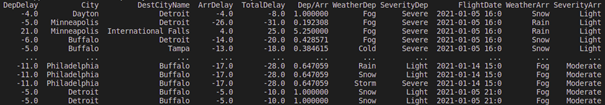

# :computer: :snake: Impact_Of_Weather_On_Flights  :snowflake: :airplane: ☔ 
###### Processing large data sets using Python language and Pandas library :uk:
###### Przetwarzanie dużych zbiorów danych przy wykorzystaniu Pythona i bilioteki Pandas :poland:

### 1. Opis problemu.
Celem mojej pracy jest przeanalizowanie wpływu różnych warunków atomosferycznych na przebieg lotów samolotowych. Chciałem przetworzyć dane w ten sposób, żeby zweryfikować jaki wpływ na przykład: opóźnienia lotów, mają poszczególne warunki atmosferyczne, z uwzględnieniem między innymi ilości opóźnień lotów ze względu na dane zjawisko pogodowe, grupując dane na poszczególne regiony / stany kraju. 

### 2. Źródła danych.
Do badań posłużyły mi dwa zbiory danych. Zbiór danych z lotami i z pogodą.  
Wszystkie użyte w badaniu zbiory, to dane dla Stanów Zjednoczonych. 

#### 2.1 Pierwszy zbiór danych -> Dane o lotach.
Pierwszy zbiór danych przedstawia informację o lotach samolotowych na terytorium Stanów Zjednoczonych. Dane te pochodzą z biura statystyki transportu. Wspomniany dataset zawiera szczegółowe informację dotyczące lotów, w skład nich wchodzą między innymi: nazwy linii lotniczych, daty wylotów oraz przylotów, numery ID lotnisk z których korzystają samoloty podczas swojej trasy, czy też występujące opóźnienia. Cały zbiór zawiera dane z okresu pomiędzy 1987 a 2022 rokiem. 

    
  <b>Obraz 1.</b>  Wycinek danych datasetu pierwszego wraz z nagłówkami.

  
#### 2.2 Drugi zbiór danych -> Pogoda. 
Drugim datasetem z którego skorzystałem, to ogólnokrajowy zbiór danych o zjawiskach pogodowych, który zawiera 7,5 miliona zdarzeń I obejmuje 49 stanów USA. Przykładami zjawisk pogodowych są deszcz, śnieg, burza I zamarzanie. Dane gromadzone są od stycznia 2016 roku do grudnia 2021 roku z wykorzystaniem historycznych raportów pogodowych zebranych z 2 071 stacji meteorologicznych na lotniskach w całym kraju. 

    
  <b>Obraz 2.</b>  Wycinek danych datasetu drugiego wraz z nagłówkami.

### 3. Wyniki

#### 3.1 Największe opóźnienie dla danego miasta
Wyniki prezentują największe opóźnienie lotów dla danego miasta wraz z uwzględnionymi warunkami atmosferycznymi.

    
  <b>Obraz 3.</b>  Wynik – Największe opóźnienie dla danego miasta.

#### 3.2 Największe opóźnienie dla konkretnej pogody

Wyniki przedstawiają największe występujące opóźnienie dla danego typu pogody.  
Opóźnienia podane są w minutach. 

    
  <b>Obraz 4.</b>  Wynik –  Największe opóźnienie dla danego typu pogody. 

#### 3.3 Opóźnienie w stosunku do nasilenia pogody. 

Wyniki przedstawiają średnie opóźnienia dla danego typu pogody, uwzględniając nasilenie.   
Widać, że największe średnie opóźnienia występują podczas dużych opadów śniegu, opóźnienia podczas takich warunków atmosferycznych są znacznie wyższe, porównując je do innych warunków atmosferycznych, nawet takich jak sztorm

    
  <b>Obraz 5.</b>  Wynik –. Średnie opóźnienia dla konkretnego typu pogody, uwzględniajac jej nasilenie.

#### 3.4	Analiza poszczególnych lotów. 

Na poniższym zrzucie ekranu, widać różnice pomiędzy opóźnieniem poszczególnego lotu, a wygenerowaną średnią opóźnienia dla danego typu pogody. 

    
  <b>Obraz 6.</b>  Wynik –. Różnica pomiędzy opóźnieniem lotu a średnią opóźnień dla poszczególnego typu pogody.

#### 3.5	Stosunek opóźnienia wylotu do przylotu

Wyniki przedstawiają stosunek opóźnienia wylotu do jego przylotu. 

    
  <b>Obraz 7.</b> Wynik –. Stosunek opóźnienia wylotu samolotu do jego przylotu. 

**Legenda:**  
Dep - Wylot  
Arr - Przylot

### 4. Wnioski
Opóźnienia lotów związane są z wieloma czynnikami, niekoniecznie jest to pogoda, co widać na przykładzie średnich opóźnień, dla każdego zjawiska pogodowego - dla niektórych jest to wartość ujemna co oznacza, że samolot przyleciał przed przewidywanym czasem przylotu.  
Na wartość średnich mogą mieć wpływ ekstremalne wartości, co mogłoby się nie zdarzyć, gdybym wykorzystał do badania mediany, zamiast wartości średniej, mimo to zauważyłem, że największym opóźnieniom dla każdego miasta towarzyszyły niesprzyjające warunki pogodowe. 

